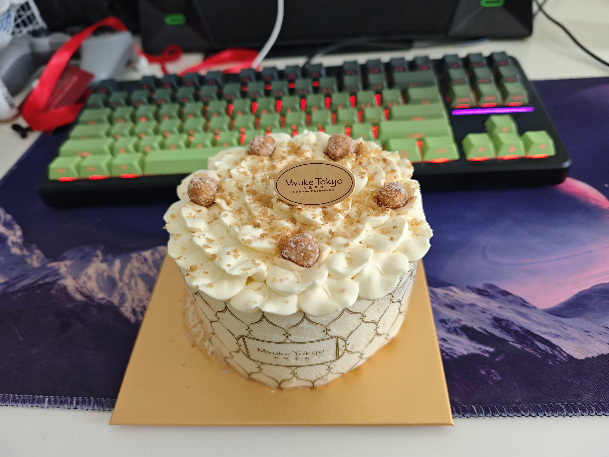

# 生活记录

## 2025-12-30
该怎么开始写呢？这个月做了一个手术，老早之前在14年就有的气胸，当时看了几次医院慢慢恢复着一直就还好。这次提了个重物后变得更加严重了，去医院先是进行了一个周的引流，发现没有任何改善后在医生的建议下进行了手术。如果说是当时害怕的话是存在一些，人生的第一次手术毕竟，但终归结果是不错的，现在也在慢慢恢复。恍惚间看到了人真的很脆弱，也担心起了家里的父母，虽说现在他们没有什么健康的问题，但那都是没有进行检查，在60多的年纪还在坐着重的体力劳动，感概作为农民的脆弱。在这里祈愿，希望他们可以一直健健康康的吧，就这样。

## 2025-10-31
人生或许就是从无知到有知再到无知吧。

## 2025-10-08

国庆假期的最后一天啦，这次回老家七天，中秋前一天就回北京务工了。基本上每天也都是躺在家里啥也不干。把单位发的卷都给家里兑了吃的，兑了一个揉面机，希望爸妈做馒头会方便一点。

我发现随着长大，自己对家里的感情也是逐渐发生变化。从最开始的嫌弃村里的很多东西，到慢慢理解村里的一些东西；从尝试改变爸妈的生活习惯，到理解爸妈的生活习惯。以前都是不希望他们外出打工，他们的年纪已经很大了，现在父亲63，母亲62，所以希望他们可以在村里老家养老。可是他们总说我没有结婚就一直也没有闲下来，总说等你结婚啦，我们就不干了。这次回家发现，父亲在和一些工友打视频电话的时候特别开心，我才突然理解，他有自己的朋友，就是他的工友，他们在一起会玩一些他们这些年纪玩的事情，聊一些他们工地上的事情。好像我就明白了，父母这一辈也是有朋友的，就算是在农村，也需要一个小的社交圈子。我不知道自己这样理解的是否准确，因为我每年回家也是仅有一两次，每次回去后的心态似乎都有一些变化，不知道是因为父母年纪越来越大对他们的担心，还是自己年纪越来越大在给自己照镜子。

就有那么一刻可能忽然人生就很恍惚，即使三十，仍旧对生活很迷茫，但身边有的人似乎很早就知道人生该如何进行下，而自己念了几年书却变得更加无知一样。记录今天的自己。

## 2025-09-19
三十而立，万事如意！
